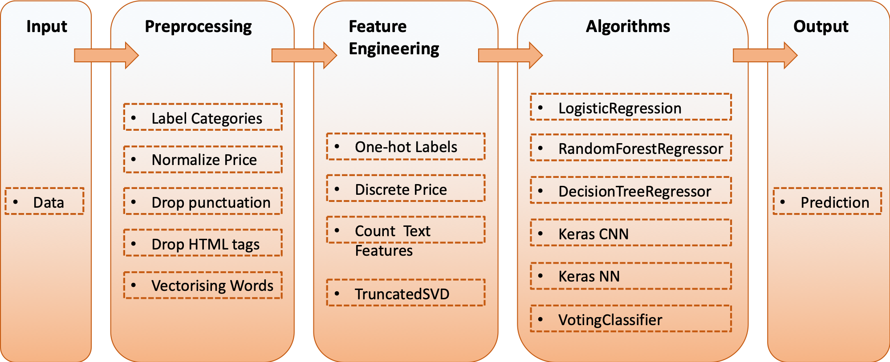

# Predicting-the-attractivenes-of-product-listings-Kaggle-Competition

This is the first Kaggle competition I enerted and this is also Data Mining course final project. I'm pleased my submission scored is #7 out of 50 teams.

### Files

* [Source code (Python)](https://github.com/chd415/Predicting-the-attractiveness-of-product-listings/blob/master/447final.ipynb)

* [Train data](https://github.com/chd415/Predicting-the-attractiveness-of-product-listings/blob/master/train_data.csv)

* [Test data](https://github.com/chd415/Predicting-the-attractiveness-of-product-listings/blob/master/test_data.csv)

* [Train label](https://github.com/chd415/Predicting-the-attractiveness-of-product-listings/blob/master/train_label.csv)

* [Predict label](https://github.com/chd415/Predicting-the-attractiveness-of-product-listings/blob/master/predict_submitted.csv)

### Methods and algorithms used in this competition

* pandas
* CountVectorizer/TfidfVectorizer/HashingVectorizer (sklearn)
* en_core_web_lg (spacy)
* LabelEncoder (sklearn)
* KBinsDiscretizer (sklearn)
* Normalizer (sklearn)
* TruncatedSVD (sklearn)
* LogisticRegression (sklearn)
* RandomForestClassifier (sklearn)
* GradientBoostingClassifier (sklearn)
* Sequential model (keras)
* VotingClassifier (sklearn)
